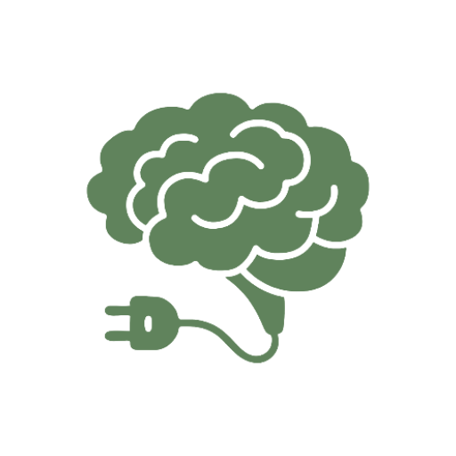

<h1 align="center">Scrolless</h1>
<h3 align="center">Anti Brain Rot App</h3>

 
     
  
   
  
     
      

**Scrolless** is an open-source Android application designed to help users avoid excessive consumption of brain rot by blocking distracting content like Instagram Reels, TikTok, and YouTube Shorts. 

Using Android's accessibility permissions, the app detects and blocks this type of content whenever it appears on the screen.
Since the app requires accessibility permissions, which can have sketchy uses, Scrolless is fully open-source.

## Features

### Implemented Features
- **Block All**  
  Instantly block access to all supported platforms, including Instagram Reels, TikTok, YouTube Shorts, and Facebook Reels.

- **Daily Limit**  
  Set a daily limit for how long you can spend on supported platforms. Once the limit is reached, access is blocked for the rest of the day.

- **Live Brain Rot Timer**  
  A real-time overlay timer tracks your session while watching Shorts or Reels, keeping you aware of your screen time.

- **Pause**   
  Pause the blocking feature for 5 minutes, allowing temporary access to the platforms.

- **Interval Timer**  
  Set intervals for usage and breaks, allowing controlled social media access throughout the day.

- **Usage Tracking** 
  Keep track of how much time you’ve spent on Instagram Reels, TikTok, YouTube Shorts, and Facebook Reels.

## Screenshots

# Architecture

Scrolless app architecture is inspired by the Google open source project [Jetcaster](https://github.com/android/compose-samples/tree/main/Jetcaster), published under the [Apache License](https://github.com/android/compose-samples/blob/main/LICENSE).

Some icons used in this app are obtained from [Icons8](https://icons8.com).

## Star History

