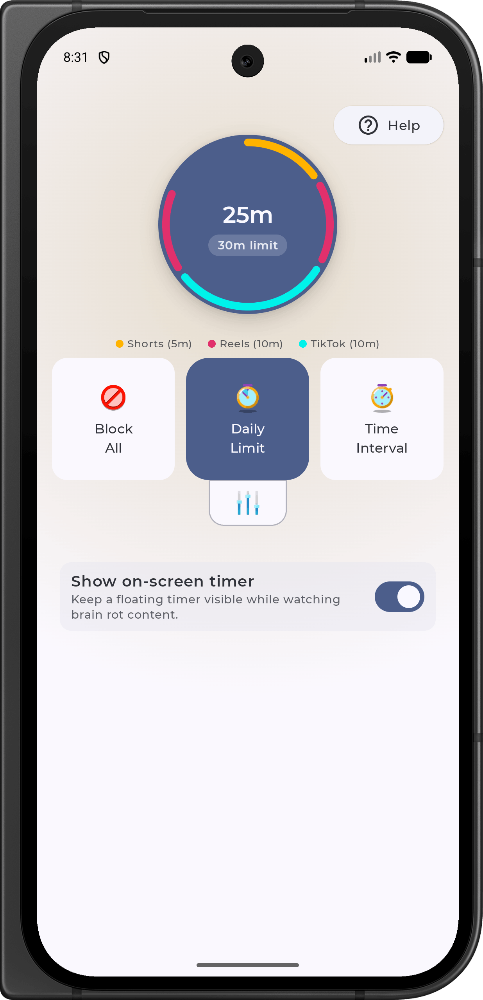
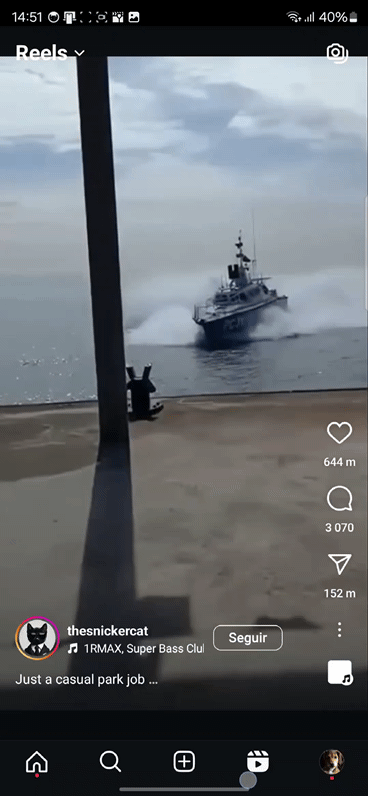

<h1 align="center">Scrolless</h1>
<h3 align="center">Anti Brain Rot App</h3>

 
     
  
     
      

<!--

-->

---

**Scrolless** is an open-source Android application designed to help users avoid excessive consumption of brain rot by blocking distracting content like Instagram Reels, TikTok, and YouTube Shorts. Using Android's accessibility permissions, the app detects and blocks this type of content whenever it appears on the screen.
Since the app requires accessibility permissions, which are significant for user privacy, Scrolless is fully open-source.

# Note

This project is a **work in progress** 🚧. 
Your feedback is very important for us - we're actively working to improve the app.

*The UI is not final*

*In future this app will be added to the Play Store*

## Features

### Implemented Features
- **Block All**  
  Instantly block access to all supported platforms, including Instagram Reels, TikTok, YouTube Shorts, and Facebook Reels.

- **Daily Limit**  
  Set a daily limit for how long you can spend on supported platforms. Once the limit is reached, access is blocked for the rest of the day.

- **Live Brain Rot Timer**  
  A real-time overlay timer tracks your session while watching Shorts or Reels, keeping you aware of your screen time.

- **Temporary Unblock**  (Upcoming Feature)   
  Unblock access to all supported platforms for a specified amount of time.

- **Interval Timer**  (Upcoming Feature)  
  Set intervals for usage and breaks, allowing controlled social media access throughout the day.

- **Usage Tracking**  (Upcoming Feature)  
  Keep track of how much time you’ve spent on Instagram Reels, TikTok, YouTube Shorts, and Facebook Reels.

## Screenshots

| Main Screen | Blocking in Action                                                                                                                                                  |
|-------------|---------------------------------------------------------------------------------------------------------------------------------------------------------------------|
|    Main screen |    As soon as the user enters the reel view, the app automatically blocks it by pressing back |

# Architecture

Scrolless app architecture is inspired by the open source project [Rorty-Android](https://github.com/developersancho/Rorty.Android/), published under the [Apache License](https://github.com/developersancho/Rorty.Android/blob/main/LICENSE).

## Acknowledgements

Scrolless code was inspired by the following open-source projects:

- [NowInAndroid](https://github.com/android/nowinandroid/) (Apache 2.0 License)
- [Rorty-Android](https://github.com/developersancho/Rorty.Android) (Apache 2.0 License)
- [Birday](https://github.com/m-i-n-a-r/birday) (GPL v3 License)

Some icons used in this app are obtained from [Icons8](https://icons8.com).

## Star History

